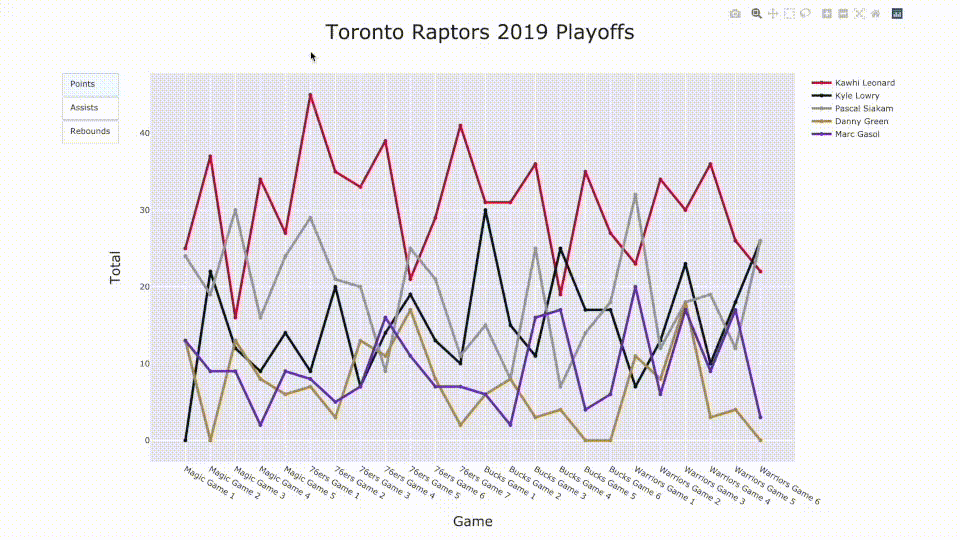

# Toronto Raptors
A visualization of the points, assists, and rebounds of the team's
starting lineup in the 2019 NBA playoffs.

## Installation
This project uses Python 3 and Plotly.

## Usage

## Credits
[William Kang](https://github.com/willkang7)
Data retrieved from [Basketball Reference](https://www.basketball-reference.com/)

## License
[MIT](LICENSE)
